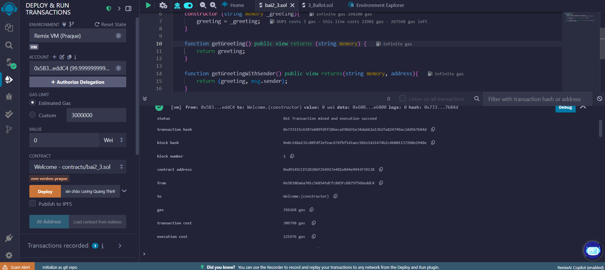
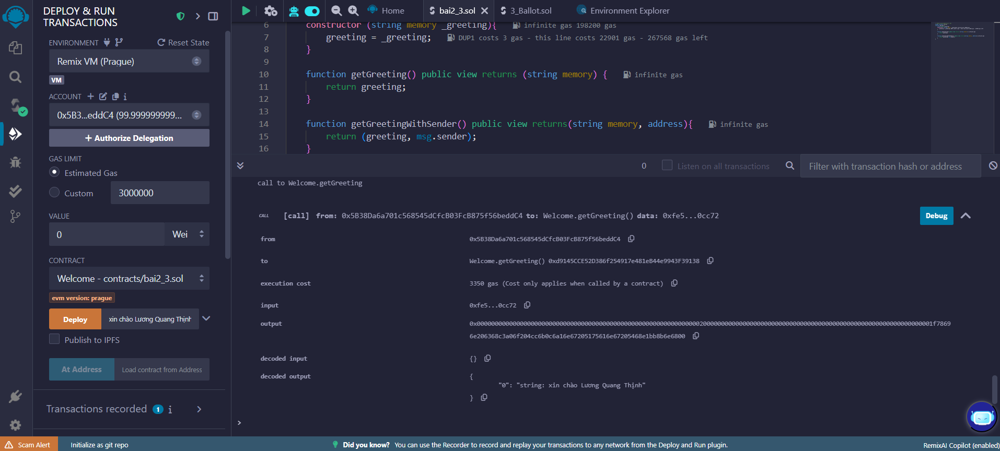
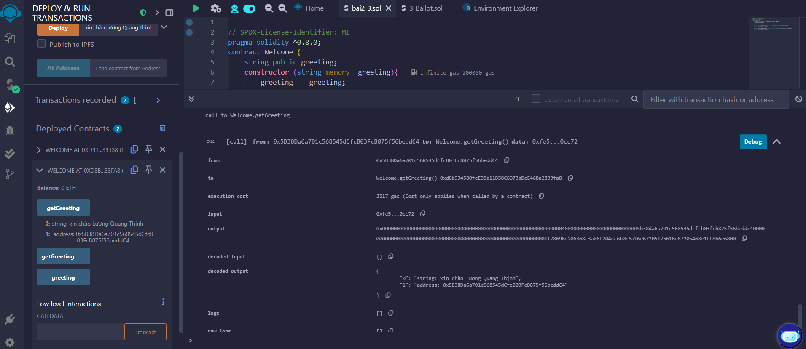

## Mã nguồn Solidity

```solidity
// SPDX-License-Identifier: MIT
pragma solidity ^0.8.0;
contract Welcome {
    string public greeting;
    constructor (string memory _greeting){
        greeting = _greeting;
    }

    function getGreeting() public view returns (string memory, address) {
        return (greeting, msg.sender);
    }
}
```
## Hình ảnh


<center>Deploy thành công</center>
<br>
<br>



<center>Gọi hàm 'getGreeting'</center>
<br>
<br>


<center>Gọi hàm 'getGreeting' có trả về địa chỉ</center>

