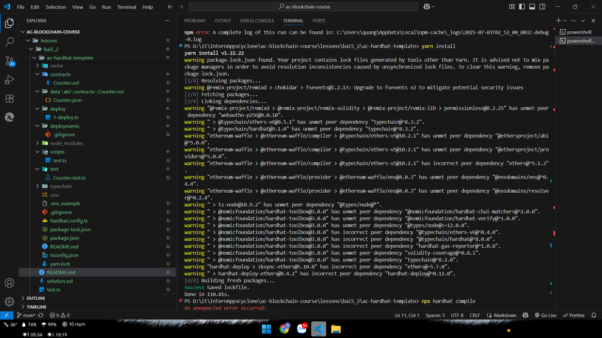
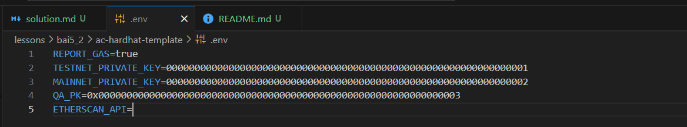
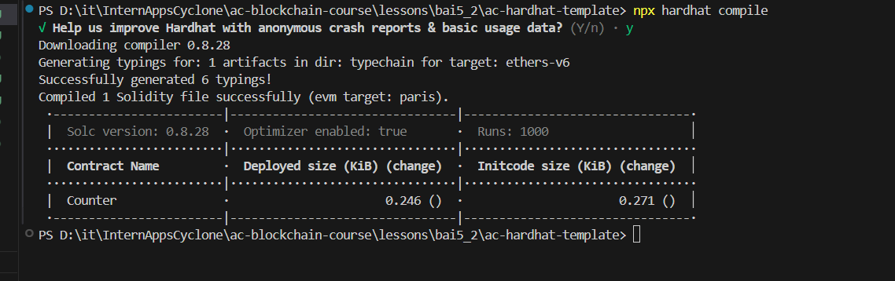
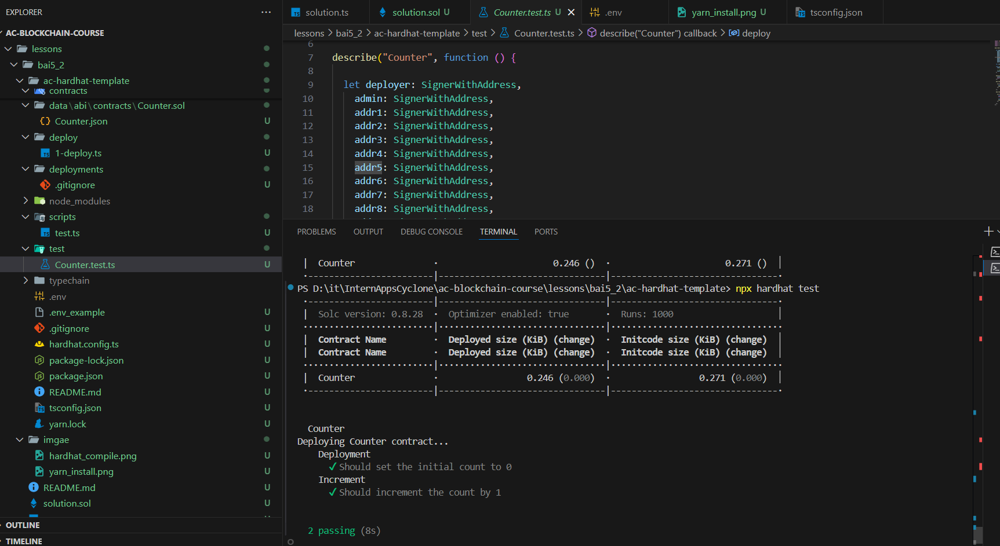
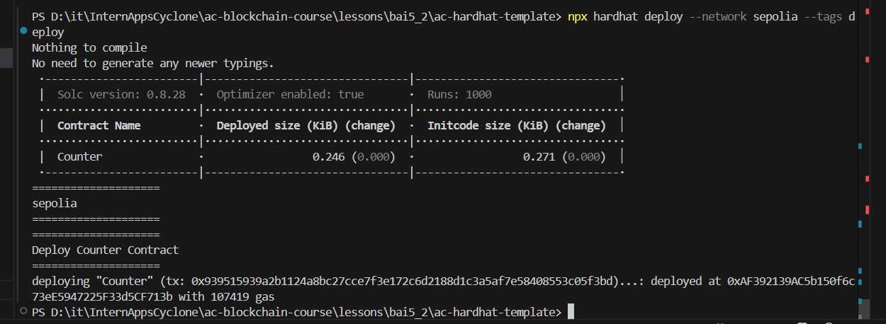
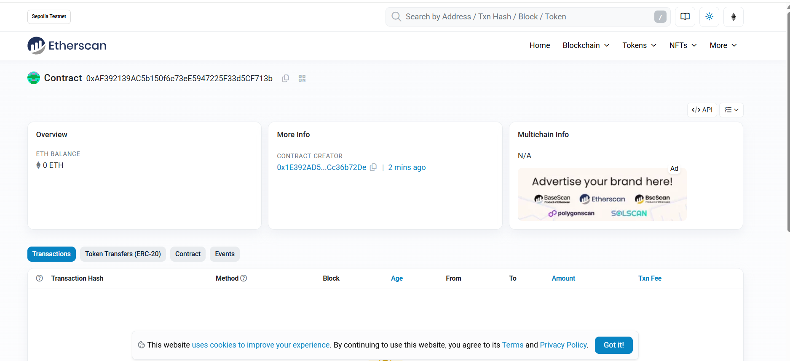
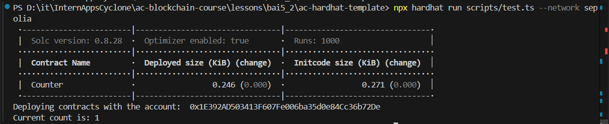
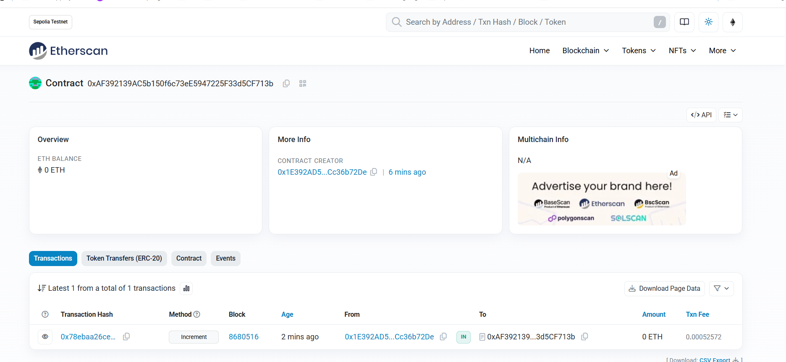

# Báo cáo 5.2 – Gửi Transaction dùng Ethers.js và Hardhat

## Các bước thực hiện

### 1. **Chuẩn bị môi trường**
- **Clone Repository**:
  ```bash
  git clone https://github.com/appscyclone/ac-hardhat-template.git
  ```
- **Tải gói cần thiết**: 
  
  *Hình 1: Chạy lệnh yarn install*

- **Lấy private key trên Meta mask và gán gán trị vào file .env**
  
  *Hình 2: Cấu hình biến môi trường*

### 2. **Biên dịch Contract**


  
  *Hình 3: Compile contract*

### 3. **Chạy Unit Test**
- Chạy file unit test `test/Counter.test.ts`.

  
  *Hình 4: Chạy unit test*

### 4. **Triển khai lên Sepolia**
- Triển khai contract `Counter` lên testnet Sepolia 
- Script `deploy/1-deploy.ts` triển khai contract và in ra địa chỉ của contract.

  
  *Hình 5: Chạy file deploy/1-deploy.ts*

- Xem contract trên Etherscan thông qua address: 
```bash
0xAF392139AC5b150f6c73eE5947225F33d5CF713b 
```
  
  *Hình 6: Smart contract trên Etherscan*


### 5. **Tương tác với Contract**
- Chạy script tương tác để gọi hàm `increment()` và lấy giá trị bộ đếm bằng `getCount()`:
  
- Chạy script `scripts/test.ts` sử dụng Ethers.js để tương tác với contract đã triển khai. Script này tăng giá trị bộ đếm và in kết quả.

  
  *Hình 7: Chạy file test.ts() và kết quả như dự kiến = 1*
- Kiểm tra trên Etherscan
  
  *Hình 8: Giao dịch gọi hàm increment() đã được thực hiện thành công trên Etherscan*

