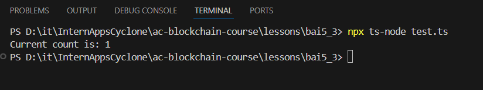

# Báo Cáo Bài 5_3: Giao tiếp với smart contract qua ABI
## 1. Smart contract
Em đã có một smart contract có tên là Counter được deploy tại địa chỉ: 
```bash
0xAF392139AC5b150f6c73eE5947225F33d5CF713b
```


  *Hình 1: Smart contract*

## 2. Tạo file test.ts để kết nối contract 

```ts
import { ethers } from "ethers";

async function main() {
  const provider = new ethers.JsonRpcProvider("https://eth-sepolia.public.blastapi.io");

  const abi = [
    "function getCount() public view returns (uint)",
    "function increment() public"
  ];
  const contractAddress = "0xAF392139AC5b150f6c73eE5947225F33d5CF713b"; 

  const contract = new ethers.Contract(contractAddress, abi, provider);

  const count = await contract.getCount();
  console.log("Current count is:", count.toString());
}

main().catch(console.error);

```

## 3. Chạy Script


  *Hình 2: Chạy Script*

