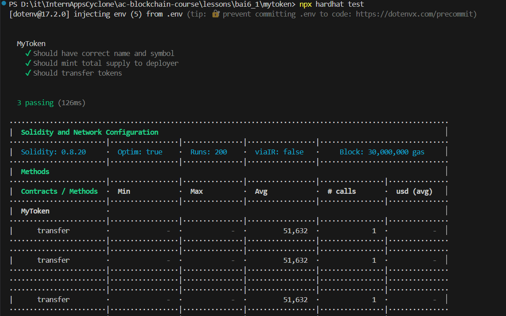
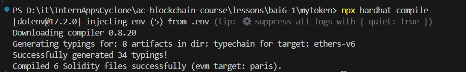
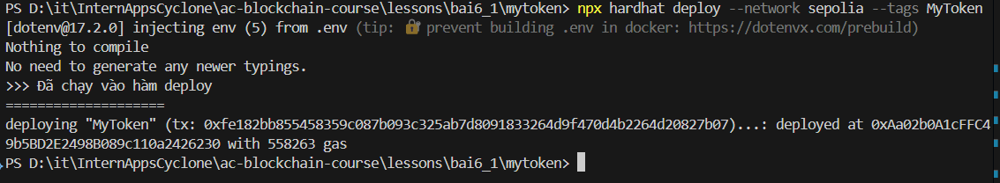
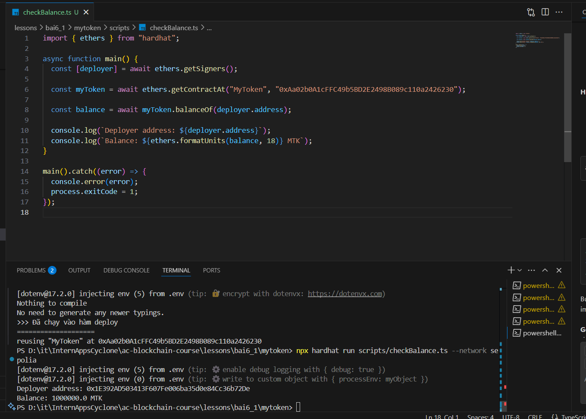

Below is the content you requested, formatted in Markdown.

# 📘 Báo cáo Bài 6.1: Deploy Token ERC20 với Hardhat Deploy

## 🔧 Các bước thực hiện

### 1\. Khởi tạo dự án

```bash
yarn init -y
```

### 2\. Cài đặt các package cần thiết

```bash
yarn add --dev hardhat typescript ts-node @types/node

yarn add --dev hardhat-deploy hardhat-deploy-ethers

yarn add --dev @nomicfoundation/hardhat-ethers@^3.0.6 ethers@^6

yarn add --dev @openzeppelin/hardhat-upgrades @openzeppelin/contracts

yarn add --dev @typechain/hardhat @typechain/ethers-v6 typechain

yarn add --dev hardhat-contract-sizer hardhat-abi-exporter hardhat-gas-reporter

yarn add --dev mocha @types/mocha chai @types/chai

yarn add --dev @nomicfoundation/hardhat-verify
```

### 3\. Cấu hình hardhat.config.ts

```typescript
import { HardhatUserConfig, task } from "hardhat/config";
import * as dotenv from "dotenv";

import "@openzeppelin/hardhat-upgrades";
import "@nomicfoundation/hardhat-verify";
import "@nomicfoundation/hardhat-ethers";
import "hardhat-deploy";
import "hardhat-deploy-ethers";
import "hardhat-contract-sizer";
import "hardhat-abi-exporter";
import "hardhat-gas-reporter";
import "@typechain/hardhat";

dotenv.config();

task("accounts", "Prints the list of accounts", async (_, hre) => {
  const accounts = await hre.ethers.getSigners();
  for (const account of accounts) {
    console.log(account.address);
  }
});

const config: HardhatUserConfig = {
  defaultNetwork: "hardhat",
  solidity: {
    compilers: [
      {
        version: "0.8.20",
        settings: {
          optimizer: { enabled: true, runs: 200 },
        },
      },
    ],
  },
  networks: {
    sepolia: {
      url: "https://eth-sepolia.public.blastapi.io",
      accounts: [process.env.TESTNET_PRIVATE_KEY!],
    },
  },
  namedAccounts: {
    deployer: {
      default: 0,
    },
  },
  typechain: {
    outDir: "typechain",
    target: "ethers-v6",
  },
};

export default config;
```

### 4\. Tạo hợp đồng ERC20

**contracts/MyToken.sol**

```solidity
// SPDX-License-Identifier: MIT
pragma solidity ^0.8.20;

import "@openzeppelin/contracts/token/ERC20/ERC20.sol";

contract MyToken is ERC20 {
    constructor() ERC20("MyToken", "MTK") {
        _mint(msg.sender, 1000000 * 10 ** decimals());
    }
}
```

### 5\. Viết script deploy

**deploy/deploy.ts**

```typescript
import { HardhatRuntimeEnvironment } from "hardhat/types";
import { DeployFunction } from "hardhat-deploy/types";

const func: DeployFunction = async function (hre: HardhatRuntimeEnvironment) {

    console.log(">>> Đã chạy vào hàm deploy");
    console.log("====================");
  const { deployments, getNamedAccounts } = hre;
  const { deploy } = deployments;
  const { deployer } = await getNamedAccounts();

  await deploy("MyToken", {
    from: deployer,
    contract: "MyToken",
    args: [],
    log: true,
  });
};

func.tags = ["deploy", "MyToken"];
export default func;

```

### 6\. Viết test kiểm tra hợp đồng

**test/MyToken.test.ts**

```typescript
import { ethers } from "hardhat";
import { expect } from "chai";
import { SignerWithAddress } from "@nomicfoundation/hardhat-ethers/signers";
import { MyToken } from "../typechain";

describe("MyToken", function () {
  let deployer: SignerWithAddress;
  let addr1: SignerWithAddress;
  let myToken: MyToken;

  const TOTAL_SUPPLY = ethers.parseUnits("1000000", 18);

  beforeEach(async () => {
    [deployer, addr1] = await ethers.getSigners();
    const factory = await ethers.getContractFactory("MyToken");
    myToken = await factory.deploy();
    await myToken.waitForDeployment();
  });

  it("Should have correct name and symbol", async () => {
    expect(await myToken.name()).to.equal("MyToken");
    expect(await myToken.symbol()).to.equal("MTK");
  });

  it("Should mint total supply to deployer", async () => {
    expect(await myToken.totalSupply()).to.equal(TOTAL_SUPPLY);
    expect(await myToken.balanceOf(deployer.address)).to.equal(TOTAL_SUPPLY);
  });

  it("Should transfer tokens", async () => {
    const amount = ethers.parseUnits("100", 18);
    await myToken.transfer(addr1.address, amount);
    expect(await myToken.balanceOf(addr1.address)).to.equal(amount);
  });
});

```

#### **Chạy Unit Test**
- Chạy file unit test `test/MyToken.test.ts`.

  
  *Hình: Chạy unit test*


### 7\. Compile hợp đồng

```bash
npx hardhat compile
```

  *Hình: Compile*


### 8\. Deploy lên mạng Sepolia

```bash
npx hardhat deploy --network sepolia --tags MyToken
```

✅ Output:

```python
deploying "MyToken"...: deployed at 0xAa02b0A1cFFC49b5BD2E2498B089c110a2426230
```

  *Hình: In ra địa chỉ sau khi deploy*


  *Hình: Kiểm tra Contract trên Ethersan*
### 9\. Viết script kiểm tra balance của deployer

**scripts/checkBalance.ts**

```typescript
import { ethers } from "hardhat";

async function main() {
  const [deployer] = await ethers.getSigners();

  const myToken = await ethers.getContractAt("MyToken", "0xAa02b0A1cFFC49b5BD2E2498B089c110a2426230");

  const balance = await myToken.balanceOf(deployer.address);

  console.log(`Deployer address: ${deployer.address}`);
  console.log(`Balance: ${ethers.formatUnits(balance, 18)} MTK`);
}

main().catch((error) => {
  console.error(error);
  process.exitCode = 1;
});
```

Chạy:

```bash
npx hardhat run scripts/checkBalance.ts --network sepolia
```

-----



  *Hình: Kiểm tra balance *

