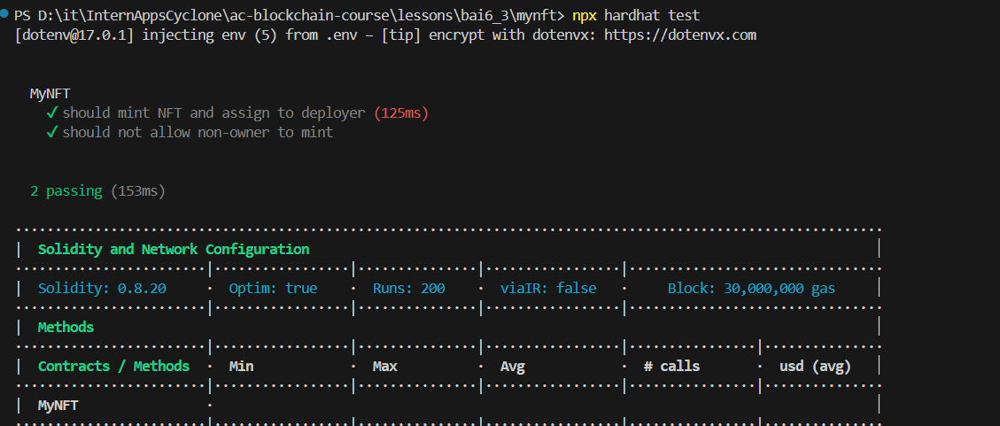
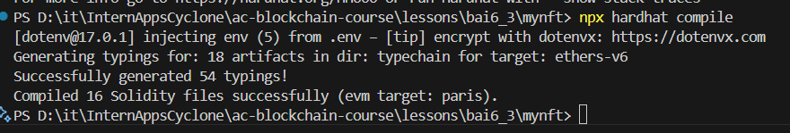
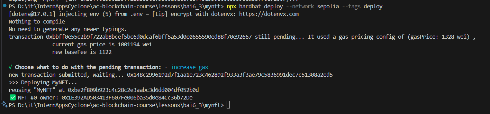
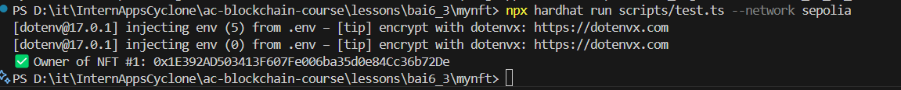
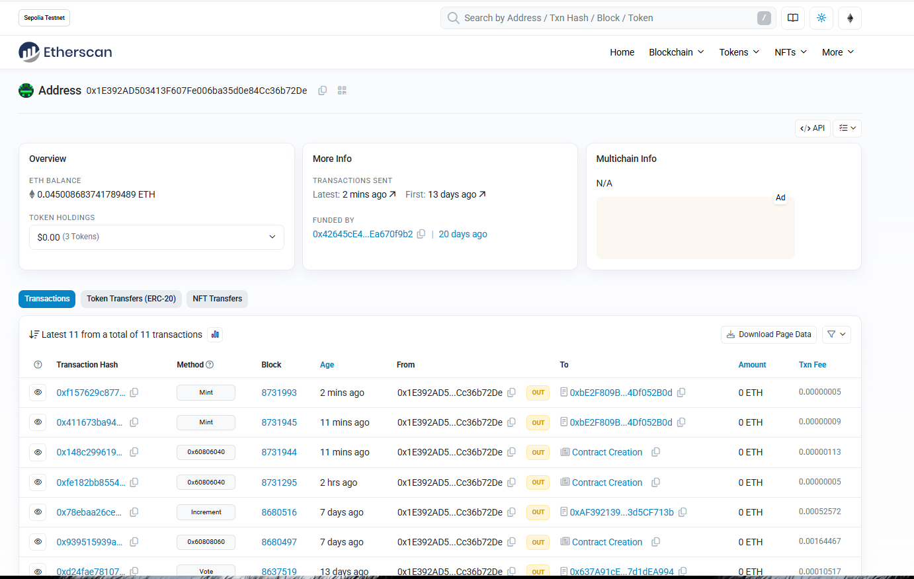

Below is the content you requested, formatted in Markdown.

# 📘 Báo cáo Bài 6.1: Deploy Token ERC721 với Hardhat Deploy

## 🔧 Các bước thực hiện

### 1\. Khởi tạo dự án

```bash
yarn init -y
```

### 2\. Cài đặt các package cần thiết

```bash
yarn add --dev hardhat typescript ts-node @types/node

yarn add --dev hardhat-deploy hardhat-deploy-ethers

yarn add --dev @nomicfoundation/hardhat-ethers@^3.0.6 ethers@^6

yarn add --dev @openzeppelin/hardhat-upgrades @openzeppelin/contracts

yarn add --dev @typechain/hardhat @typechain/ethers-v6 typechain

yarn add --dev hardhat-contract-sizer hardhat-abi-exporter hardhat-gas-reporter

yarn add --dev mocha @types/mocha chai @types/chai

yarn add --dev @nomicfoundation/hardhat-chai-matchers

yarn add --dev @nomicfoundation/hardhat-verify
```

### 3\. Cấu hình hardhat.config.ts

```typescript
import { HardhatUserConfig, task } from "hardhat/config";
import * as dotenv from "dotenv";

import "@nomicfoundation/hardhat-chai-matchers";
import "@openzeppelin/hardhat-upgrades";
import "@nomicfoundation/hardhat-verify";
import "@nomicfoundation/hardhat-ethers";
import "hardhat-deploy";
import "hardhat-deploy-ethers";
import "hardhat-contract-sizer";
import "hardhat-abi-exporter";
import "hardhat-gas-reporter";
import "@typechain/hardhat";

dotenv.config();

task("accounts", "Prints the list of accounts", async (_, hre) => {
  const accounts = await hre.ethers.getSigners();
  for (const account of accounts) {
    console.log(account.address);
  }
});

const config: HardhatUserConfig = {
  defaultNetwork: "hardhat",
  solidity: {
    compilers: [
      {
        version: "0.8.20",
        settings: {
          optimizer: { enabled: true, runs: 200 },
        },
      },
    ],
  },
  networks: {
    sepolia: {
      url: "https://eth-sepolia.public.blastapi.io",
      accounts: [process.env.TESTNET_PRIVATE_KEY!],
    },
  },
  namedAccounts: {
    deployer: {
      default: 0,
    },
  },
  typechain: {
    outDir: "typechain",
    target: "ethers-v6",
  },
};

export default config;
```

### 4\. Tạo hợp đồng ERC721

**contracts/MyNFT.sol**

```solidity
// SPDX-License-Identifier: MIT
pragma solidity ^0.8.20;

import "@openzeppelin/contracts/token/ERC721/ERC721.sol";
import "@openzeppelin/contracts/access/Ownable.sol";

contract MyNFT is ERC721, Ownable {
    uint256 public nextTokenId;

    constructor(address initialOwner) ERC721("MyNFT", "MNFT") Ownable(initialOwner) {}

    function mint(address to) external onlyOwner {
        _safeMint(to, nextTokenId);
        nextTokenId++;
    }
}

```

### 5\. Viết script deploy

**deploy/deploy.ts**

```typescript
import { HardhatRuntimeEnvironment } from "hardhat/types";
import { DeployFunction } from "hardhat-deploy/types";
import { ethers } from "hardhat";

const func: DeployFunction = async function (hre: HardhatRuntimeEnvironment) {
  const { deployments, getNamedAccounts } = hre;
  const { deploy, log } = deployments;
  const { deployer } = await getNamedAccounts();

  log(">>> Deploying MyNFT...");

  const result = await deploy("MyNFT", {
    from: deployer,
    args: [deployer],
    log: true,
    autoMine: true,
  });

  const myNFT = await ethers.getContractAt("MyNFT", result.address);
  const mintTx = await myNFT.mint(deployer);
  await mintTx.wait();

  const owner = await myNFT.ownerOf(0);
  console.log(`✅ NFT #0 owner: ${owner}`);
};

func.tags = ["deploy"];
export default func;


```

### 6\. Viết test kiểm tra hợp đồng

**test/MyNFT.test.ts**

```typescript
import { ethers } from "hardhat";
import { expect } from "chai";
import { MyNFT } from "../typechain";

describe("MyNFT", function () {
  it("should mint NFT and assign to deployer", async function () {
    const [deployer] = await ethers.getSigners();
    const MyNFTFactory = await ethers.getContractFactory("MyNFT");
    const myNFT = (await MyNFTFactory.deploy(deployer.address)) as MyNFT;
    await myNFT.waitForDeployment();

    const tx = await myNFT.mint(deployer.address);
    await tx.wait();

    const owner = await myNFT.ownerOf(0);
    expect(owner).to.equal(deployer.address);
  });

  it("should not allow non-owner to mint", async function () {
    const [deployer, attacker] = await ethers.getSigners();
    const MyNFTFactory = await ethers.getContractFactory("MyNFT");
    const myNFT = (await MyNFTFactory.deploy(deployer.address)) as MyNFT;
    await myNFT.waitForDeployment();

    await expect(
        myNFT.connect(attacker).mint(attacker.address)
    ).to.be.revertedWithCustomError(myNFT, "OwnableUnauthorizedAccount");

  });
});


```

#### **Chạy Unit Test**
- Chạy file unit test `test/MyNFT.test.ts`.

  
  *Hình: Chạy unit test*


### 7\. Compile hợp đồng

```bash
npx hardhat compile
```

  *Hình: Compile*


### 8\. Deploy lên mạng Sepolia

```bash
npx hardhat deploy --network sepolia --tags deploy
```


  *Hình: Deploy thành công*

### 9\. Viết script để mint một NFT và trả về địa chỉ sở hữu.

**scripts/test.ts**

```typescript
import { ethers } from "hardhat";
import { MyNFT } from "../typechain";

async function main() {
  const [deployer] = await ethers.getSigners();

  const myNFT = (await ethers.getContract("MyNFT")) as MyNFT;

  const tx = await myNFT.mint(deployer.address);
  await tx.wait();

  const tokenId = 1;
  const owner = await myNFT.ownerOf(tokenId);
  console.log(`✅ Owner of NFT #${tokenId}: ${owner}`);
}

main().catch((error) => {
  console.error(error);
  process.exitCode = 1;
});

```

Chạy:

```bash
npx hardhat run scripts/checkBalance.ts --network sepolia
```

-----



  *Hình: Test thành công*


*Hình: Kiểm tra các mint được tạo trên Ethersan*

