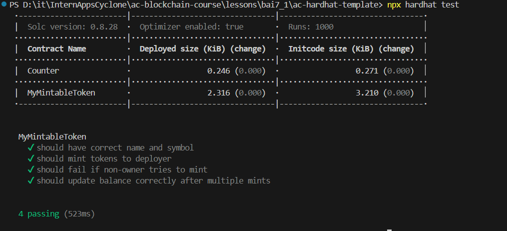

# Báo cáo 7.1 – Mint Token ERC20

## Các bước thực hiện

### 1. **Viết contract**

```solidity
// SPDX-License-Identifier: MIT
pragma solidity ^0.8.0;

import "@openzeppelin/contracts/token/ERC20/ERC20.sol";
import "@openzeppelin/contracts/access/Ownable.sol";

contract MyMintableToken is ERC20, Ownable {
    constructor(string memory name, string memory symbol, address initialOwner)
    ERC20(name, symbol)
    Ownable(initialOwner){}


    function mint(address to, uint256 amount) public onlyOwner {
        _mint(to, amount);
    }
}
```

### 2. **Biên dịch Contract**


  
  *Hình 3: Compile contract*

### 3. **Chạy Unit Test**
- Chạy file unit test `test/MyMintableToken.test.ts`.

  
  *Hình 4: Chạy unit test*

### 4. **Triển khai lên Sepolia**
- Triển khai contract `MyMintableToken` lên testnet Sepolia 
- Script `scripts/deploy.ts` triển khai contract và in ra địa chỉ của contract , mint và hiện số dư.

  
  *Hình 5: Chạy file scripts/deploy.ts*

- Xem contract trên Etherscan thông qua address: 
```bash
 0xAC7DB49b5a03e5755e75f22c8928244394b10744
```
  
  *Hình 6: Smart contract trên Etherscan*

