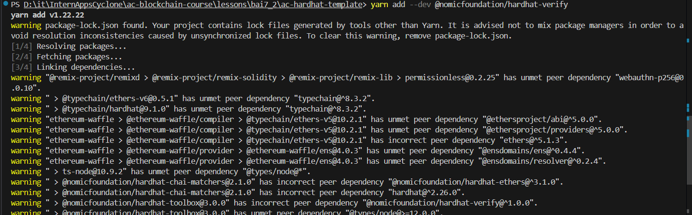
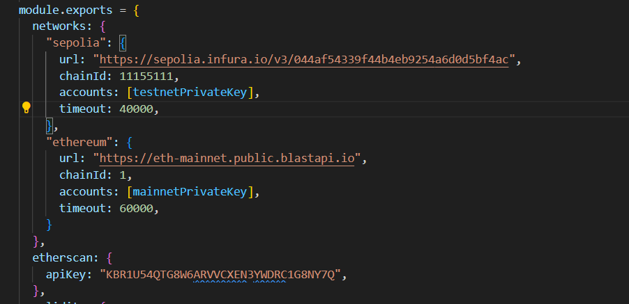
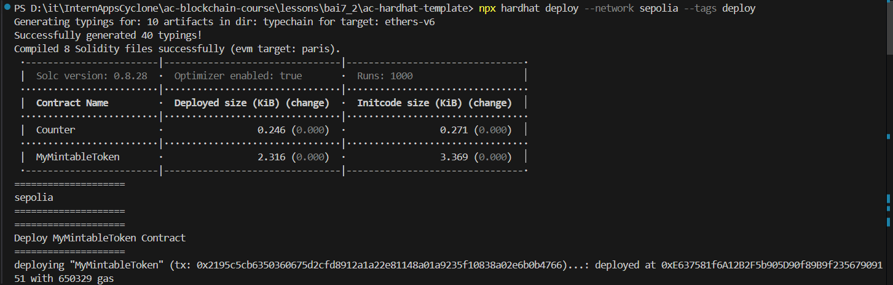
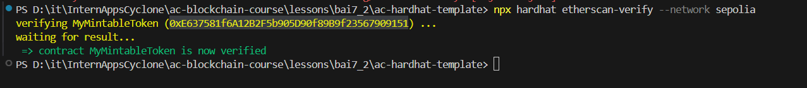
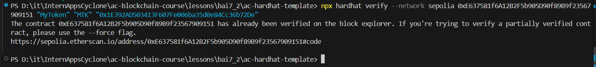

# Báo cáo 7.2 – Verify MyMintableToken trên Etherscan

## Các bước thực hiện

### 1. **Cài thêm dependency @nomicfoundation/hardhat-verify**

```bash
yarn add --dev @nomicfoundation/hardhat-verify
```

  *Hình : Thêm dependency*


### 2. **Thêm cấu hình vào `hardhat.config.ts`**


  
  *Hình : Thêm cấu hình*

### 3. **Triển khai lên Sepolia**
- Triển khai contract `MyMintableToken` lên testnet Sepolia 
- Script `deploy/1-deploy.ts` triển khai contract và in ra địa chỉ của contract.

  
  *Hình : Chạy file deploy/1-deploy.ts*


### 4. **Verify contract**
- Cách 1:  Tự động ( do deploy bằng Hardhat Deploy)
  
```bash
npx hardhat etherscan-verify --network sepolia
```
  
  *Hình : Verify tự động lấy contract address và constructor arguments.*

- Cách 2: Verify thủ công nếu cần truyền constructor arguments
  
```bash
npx hardhat verify --network sepolia 0xE637581f6A12B2F5b905D90f89B9f23567909151 "MyToken" "MTK" "0x1E392AD503413F607Fe006ba35d0e84Cc36b72De"
```
  
  *Hình : Verify điền thủ công về contract address và constructor args.*

## Nộp kết quả
- Địa chỉ contract: 0xE637581f6A12B2F5b905D90f89B9f23567909151
- Link verify trên Etherscan: https://sepolia.etherscan.io/address/0xE637581f6A12B2F5b905D90f89B9f23567909151#code
- Screenshot verify thành công:
  
  


