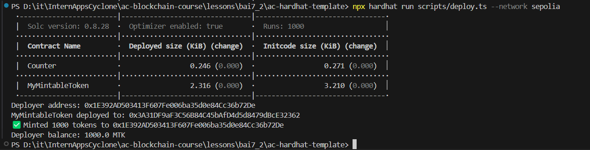

# Báo cáo 7.2 – Verify MyMintableToken trên Etherscan

## Các bước thực hiện

### 1. **Cài thêm dependency @nomicfoundation/hardhat-verify**

```bash
yarn add --dev @nomicfoundation/hardhat-verify
```

  *Hình : Thêm dependency*


### 2. **Thêm cấu hình vào `hardhat.config.ts`**


  
  *Hình : Thêm cấu hình*

### 3. **Triển khai lên Sepolia**
- Triển khai contract `MyMintableToken` lên testnet Sepolia 
- Script `scripts/deploy.ts` triển khai contract và in ra địa chỉ của contract.

  
  *Hình : Chạy file scripts/deploy.ts*


### 4. **Verify contract**
  
```bash
npx hardhat verify --network sepolia 0x3A31DF9aF3C56B84C45bAfD4d5d8479dBcE32362
```
  
  *Hình : Verify*

## Nộp kết quả
- Địa chỉ contract: 0x3A31DF9aF3C56B84C45bAfD4d5d8479dBcE32362
- Link verify trên Etherscan: https://sepolia.etherscan.io/address/0x3A31DF9aF3C56B84C45bAfD4d5d8479dBcE32362#code
- Screenshot verify thành công:
  
  


